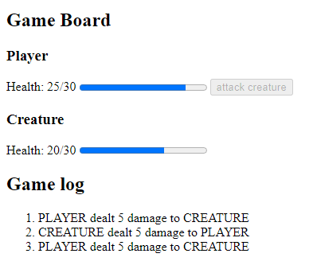

# wasm-combat-demo

A prototype of combat between two entities, the Player and a Creature, that logs and updates the frontend with damage dealt and taken. Game logic is handled via a combination of Rust compiled to WebAssembly and JavaScript.

## Dev Commands

- `wasm-pack-build` - Build rust cargo
- `npm run start` - Local server (run in `/www/`)
